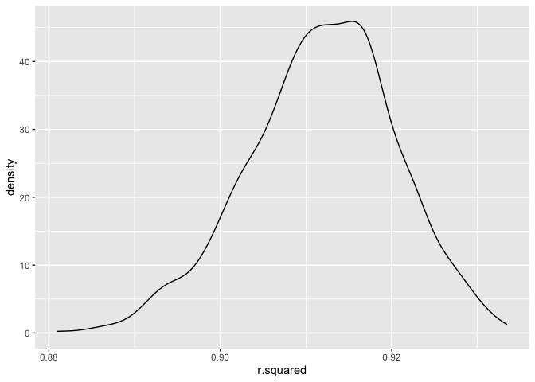
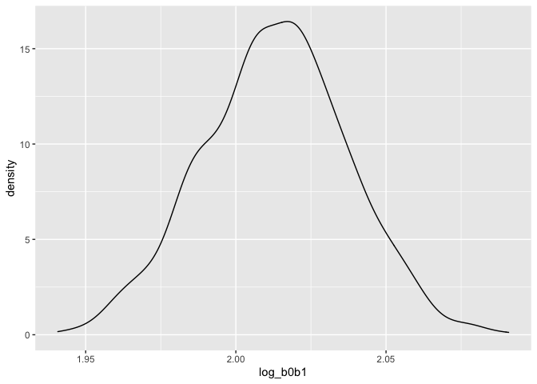
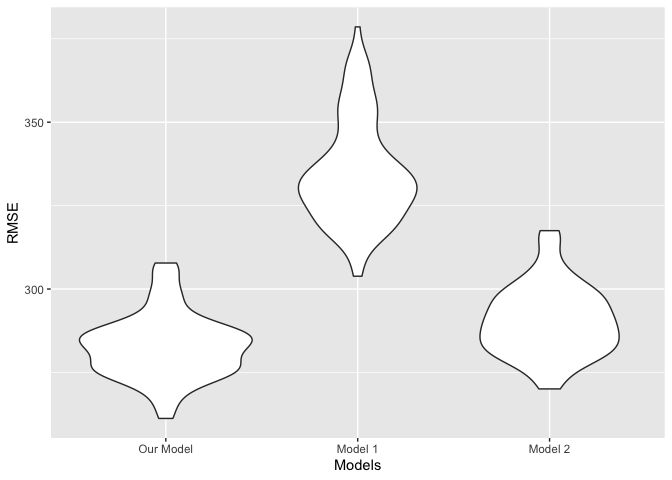

P8105 HW6 \| Jagjit Singh \| UNI: JS5958
================

``` r
library(tidyverse)
```

    ## ── Attaching packages ─────────────────────────────────────── tidyverse 1.3.2 ──
    ## ✔ ggplot2 3.3.6      ✔ purrr   0.3.5 
    ## ✔ tibble  3.1.8      ✔ dplyr   1.0.10
    ## ✔ tidyr   1.2.1      ✔ stringr 1.5.0 
    ## ✔ readr   2.1.3      ✔ forcats 0.5.2 
    ## ── Conflicts ────────────────────────────────────────── tidyverse_conflicts() ──
    ## ✖ dplyr::filter() masks stats::filter()
    ## ✖ dplyr::lag()    masks stats::lag()

``` r
library(viridis)
```

    ## Loading required package: viridisLite

``` r
library(dplyr)
library(purrr)
library(broom)
```

### Problem 1

To obtain a distribution for $\hat{r}^2$, we’ll follow basically the
same procedure we used for regression coefficients: draw bootstrap
samples; the a model to each; extract the value I’m concerned with; and
summarize. Here, we’ll use `modelr::bootstrap` to draw the samples and
`broom::glance` to produce `r.squared` values.

``` r
weather_df = 
  rnoaa::meteo_pull_monitors(
    c("USW00094728"),
    var = c("PRCP", "TMIN", "TMAX"), 
    date_min = "2017-01-01",
    date_max = "2017-12-31") %>%
  mutate(
    name = recode(id, USW00094728 = "CentralPark_NY"),
    tmin = tmin / 10,
    tmax = tmax / 10) %>%
  select(name, id, everything())
```

    ## Registered S3 method overwritten by 'hoardr':
    ##   method           from
    ##   print.cache_info httr

    ## using cached file: ~/Library/Caches/R/noaa_ghcnd/USW00094728.dly

    ## date created (size, mb): 2022-12-03 11:32:11 (8.426)

    ## file min/max dates: 1869-01-01 / 2022-11-30

``` r
weather_df %>% 
  modelr::bootstrap(n = 1000) %>% 
  mutate(
    models = map(strap, ~lm(tmax ~ tmin, data = .x) ),
    results = map(models, broom::glance)) %>% 
  select(-strap, -models) %>% 
  unnest(results) %>% 
  ggplot(aes(x = r.squared)) + geom_density()
```

<!-- -->

In this example, the $\hat{r}^2$ value is high, and the upper bound at 1
may be a cause for the generally skewed shape of the distribution. If we
wanted to construct a confidence interval for $R^2$, we could take the
2.5% and 97.5% quantiles of the estimates across bootstrap samples.
However, because the shape isn’t symmetric, using the mean +/- 1.96
times the standard error probably wouldn’t work well.

We can produce a distribution for $\log(\beta_0 * \beta1)$ using a
similar approach, with a bit more wrangling before we make our plot.

``` r
weather_df %>% 
  modelr::bootstrap(n = 1000) %>% 
  mutate(
    models = map(strap, ~lm(tmax ~ tmin, data = .x) ),
    results = map(models, broom::tidy)) %>% 
  select(-strap, -models) %>% 
  unnest(results) %>% 
  select(id = `.id`, term, estimate) %>% 
  pivot_wider(
    names_from = term, 
    values_from = estimate) %>% 
  rename(beta0 = `(Intercept)`, beta1 = tmin) %>% 
  mutate(log_b0b1 = log(beta0 * beta1)) %>% 
  ggplot(aes(x = log_b0b1)) + geom_density()
```

<!-- -->

As with $r^2$, this distribution is somewhat skewed and has some
outliers.

The point of this is not to say you should always use the bootstrap –
it’s possible to establish “large sample” distributions for strange
parameters / values / summaries in a lot of cases, and those are great
to have. But it is helpful to know that there’s a way to do inference
even in tough cases.

# Problem 2

Loading homicide data and cleaning it. Also creating a city_state
variable (e.g. “Baltimore, MD”), and a binary variable indicating
whether the homicide is solved:

``` r
df =
  read.csv("./data/homicide-data.csv", na = c("", "Unknown")) %>% 
  mutate(
    city_state = str_c(city, ', ', state),
    resolved = case_when(
           disposition =="Closed without arrest" ~ 0,
           disposition =="Open/No arrest" ~ 0,
           disposition =="Closed by arrest" ~ 1
         ))
```

Removing cities Dallas, TX; Phoenix, AZ; and Kansas City, MO – these
don’t report victim race. Also removing Tulsa, AL:

``` r
df <- df %>%
  subset(city_state!="Phoenix, AZ" & city_state!="Kansas City, MO" & 
  city_state!="Tulsa, AL" & city_state!="Dallas, TX")
```

Filtering for victim_race = white or black

``` r
df <- df %>%
  filter(victim_race == "White" | victim_race == "Black")
```

``` r
df <- df %>%
  mutate(victim_age = as.numeric(victim_age))
```

For the city of Baltimore MD, using the glm function to fit a logistic
regression with resolved vs unresolved as the outcome and victim age,
sex and race as predictors:

``` r
baltimore_data <- df %>%
  filter(city_state == "Baltimore, MD")  %>% 
  select(resolved, victim_age, victim_race, victim_sex)

dat = baltimore_data %>%
  mutate(victim_sex =  as.factor(victim_sex),
         victim_race = as.factor(victim_race))
baltimore_model <- glm(resolved ~ victim_age + victim_sex + victim_race, 
                       data = dat, family = "binomial")

baltimore_model %>% 
  broom::tidy(conf.int = T) %>% 
  mutate(OR = exp(estimate),
         CI_lower = exp(conf.low),
         CI_upper = exp(conf.high),
         p_val = rstatix::p_format(p.value, digits = 2)) %>% 
  select(term, OR, CI_lower,CI_upper, p_val) %>% 
  knitr::kable(digits = 3, align = "lccc", 
               col.names = c("Term", "Estimated adjusted OR", "CI lower bound", 
                             "CI upper bound", "p-value"))
```

| Term             | Estimated adjusted OR | CI lower bound | CI upper bound | p-value  |
|:-----------------|:---------------------:|:--------------:|:--------------:|:---------|
| (Intercept)      |         1.363         |     0.976      |     1.911      | 0.07     |
| victim_age       |         0.993         |     0.987      |     1.000      | 0.043    |
| victim_sexMale   |         0.426         |     0.324      |     0.558      | \<0.0001 |
| victim_raceWhite |         2.320         |     1.650      |     3.276      | \<0.0001 |

From the model summary we can see that, for the city of Baltimore
homicides with female victims have a higher chance (more likely) of
being resolved versus homicides with male victims, while controlling for
all other variables.

Running a glm for each of the cities in the dataset, and extracting the
adjusted odds ratio (and CI) for solving homicides comparing male
victims to female victims:

``` r
df_cities = df %>% 
  nest(data = -city_state) %>%
  mutate(
    models = map(data, ~glm(resolved ~ victim_race + victim_sex + victim_age, 
                            data = ., family = binomial(link = "logit"))),
    results = map(models, ~broom::tidy(.x, conf.int = T))) %>% 
  select(city_state, results) %>% 
  unnest(results) %>% 
  mutate(OR = exp(estimate),CI_lower = exp(conf.low),CI_upper = exp(conf.high),
    p_val = rstatix::p_format(p.value, digits = 3)
  ) %>% 
  filter(term == "victim_sexMale") %>% 
  select(city_state, CI_lower, OR, CI_upper, p_val) 

df_cities%>% 
  knitr::kable(digits = 3, align = "llccc", col.names = 
                 c("City", "Estimated adjusted OR", "CI lower bound", 
                   "CI upper bound", "p-value"))
```

| City               | Estimated adjusted OR | CI lower bound | CI upper bound | p-value  |
|:-------------------|:----------------------|:--------------:|:--------------:|:--------:|
| Albuquerque, NM    | 0.825                 |     1.767      |     3.762      | 0.139299 |
| Atlanta, GA        | 0.680                 |     1.000      |     1.458      | 0.999683 |
| Baltimore, MD      | 0.324                 |     0.426      |     0.558      | \<0.0001 |
| Baton Rouge, LA    | 0.204                 |     0.381      |     0.684      | 0.001654 |
| Birmingham, AL     | 0.571                 |     0.870      |     1.314      | 0.511145 |
| Boston, MA         | 0.351                 |     0.667      |     1.260      | 0.212134 |
| Buffalo, NY        | 0.288                 |     0.521      |     0.936      | 0.028952 |
| Charlotte, NC      | 0.551                 |     0.884      |     1.391      | 0.600408 |
| Chicago, IL        | 0.336                 |     0.410      |     0.501      | \<0.0001 |
| Cincinnati, OH     | 0.231                 |     0.400      |     0.667      | 0.000649 |
| Columbus, OH       | 0.377                 |     0.532      |     0.748      | 0.000304 |
| Denver, CO         | 0.233                 |     0.479      |     0.962      | 0.041096 |
| Detroit, MI        | 0.462                 |     0.582      |     0.734      | \<0.0001 |
| Durham, NC         | 0.382                 |     0.812      |     1.658      | 0.576108 |
| Fort Worth, TX     | 0.394                 |     0.669      |     1.121      | 0.131169 |
| Fresno, CA         | 0.567                 |     1.335      |     3.048      | 0.496382 |
| Houston, TX        | 0.557                 |     0.711      |     0.906      | 0.005932 |
| Indianapolis, IN   | 0.678                 |     0.919      |     1.241      | 0.581893 |
| Jacksonville, FL   | 0.536                 |     0.720      |     0.965      | 0.028323 |
| Las Vegas, NV      | 0.606                 |     0.837      |     1.151      | 0.277609 |
| Long Beach, CA     | 0.143                 |     0.410      |     1.024      | 0.071763 |
| Los Angeles, CA    | 0.457                 |     0.662      |     0.954      | 0.027927 |
| Louisville, KY     | 0.301                 |     0.491      |     0.784      | 0.00337  |
| Memphis, TN        | 0.526                 |     0.723      |     0.984      | 0.042046 |
| Miami, FL          | 0.304                 |     0.515      |     0.873      | 0.013477 |
| Milwaukee, wI      | 0.495                 |     0.727      |     1.054      | 0.097672 |
| Minneapolis, MN    | 0.476                 |     0.947      |     1.881      | 0.875728 |
| Nashville, TN      | 0.681                 |     1.034      |     1.556      | 0.872888 |
| New Orleans, LA    | 0.422                 |     0.585      |     0.812      | 0.001311 |
| New York, NY       | 0.133                 |     0.262      |     0.485      | \<0.0001 |
| Oakland, CA        | 0.364                 |     0.563      |     0.867      | 0.009374 |
| Oklahoma City, OK  | 0.623                 |     0.974      |     1.520      | 0.907936 |
| Omaha, NE          | 0.199                 |     0.382      |     0.711      | 0.002951 |
| Philadelphia, PA   | 0.376                 |     0.496      |     0.650      | \<0.0001 |
| Pittsburgh, PA     | 0.263                 |     0.431      |     0.696      | 0.000672 |
| Richmond, VA       | 0.483                 |     1.006      |     1.994      | 0.986584 |
| San Antonio, TX    | 0.393                 |     0.705      |     1.238      | 0.230337 |
| Sacramento, CA     | 0.326                 |     0.669      |     1.314      | 0.254806 |
| Savannah, GA       | 0.419                 |     0.867      |     1.780      | 0.697352 |
| San Bernardino, CA | 0.166                 |     0.500      |     1.462      | 0.205666 |
| San Diego, CA      | 0.191                 |     0.413      |     0.830      | 0.017217 |
| San Francisco, CA  | 0.312                 |     0.608      |     1.155      | 0.133616 |
| St. Louis, MO      | 0.530                 |     0.703      |     0.932      | 0.014388 |
| Stockton, CA       | 0.626                 |     1.352      |     2.994      | 0.447451 |
| Tampa, FL          | 0.340                 |     0.808      |     1.860      | 0.619393 |
| Tulsa, OK          | 0.609                 |     0.976      |     1.544      | 0.917458 |
| Washington, DC     | 0.466                 |     0.691      |     1.014      | 0.06167  |

Creating a plot that shows the estimated ORs and CIs for each city:

``` r
df_cities %>% 
  mutate(city_state = fct_reorder(city_state, OR)) %>%
  ggplot(aes(x = city_state, y = OR)) +
  geom_point(size = 1, aes(colour = OR)) +
  geom_errorbar(aes(ymin = CI_lower, ymax = CI_upper)) +
  theme(axis.text.x = element_text(angle = 90, vjust = 0.5, hjust = 1)) +
  labs(x = "City, State", y = "Estimated OR with CI")
```

<!-- -->
From the plot we can see that for most cities, the estimated odds ratio
is less than 1. In-fact for almost half of cities, 1 is still higher
than their confidence interval upper-limit. This implies that homicides
with female victims have a higher chance (more likely) of being resolved
versus homicides with male victims, while controlling for all other
variables.

# Problem 3

Loading data and cleaning the data:

``` r
df_weight <- 
  read_csv("./data/birthweight.csv") %>%
  janitor::clean_names()
```

    ## Rows: 4342 Columns: 20
    ## ── Column specification ────────────────────────────────────────────────────────
    ## Delimiter: ","
    ## dbl (20): babysex, bhead, blength, bwt, delwt, fincome, frace, gaweeks, malf...
    ## 
    ## ℹ Use `spec()` to retrieve the full column specification for this data.
    ## ℹ Specify the column types or set `show_col_types = FALSE` to quiet this message.

Checking for any missing values and computing summary statistics:

``` r
skimr :: skim(df_weight)
```

|                                                  |           |
|:-------------------------------------------------|:----------|
| Name                                             | df_weight |
| Number of rows                                   | 4342      |
| Number of columns                                | 20        |
| \_\_\_\_\_\_\_\_\_\_\_\_\_\_\_\_\_\_\_\_\_\_\_   |           |
| Column type frequency:                           |           |
| numeric                                          | 20        |
| \_\_\_\_\_\_\_\_\_\_\_\_\_\_\_\_\_\_\_\_\_\_\_\_ |           |
| Group variables                                  | None      |

Data summary

**Variable type: numeric**

| skim_variable | n_missing | complete_rate |    mean |     sd |     p0 |     p25 |     p50 |     p75 |   p100 | hist  |
|:--------------|----------:|--------------:|--------:|-------:|-------:|--------:|--------:|--------:|-------:|:------|
| babysex       |         0 |             1 |    1.49 |   0.50 |   1.00 |    1.00 |    1.00 |    2.00 |    2.0 | ▇▁▁▁▇ |
| bhead         |         0 |             1 |   33.65 |   1.62 |  21.00 |   33.00 |   34.00 |   35.00 |   41.0 | ▁▁▆▇▁ |
| blength       |         0 |             1 |   49.75 |   2.72 |  20.00 |   48.00 |   50.00 |   51.00 |   63.0 | ▁▁▁▇▁ |
| bwt           |         0 |             1 | 3114.40 | 512.15 | 595.00 | 2807.00 | 3132.50 | 3459.00 | 4791.0 | ▁▁▇▇▁ |
| delwt         |         0 |             1 |  145.57 |  22.21 |  86.00 |  131.00 |  143.00 |  157.00 |  334.0 | ▅▇▁▁▁ |
| fincome       |         0 |             1 |   44.11 |  25.98 |   0.00 |   25.00 |   35.00 |   65.00 |   96.0 | ▃▇▅▂▃ |
| frace         |         0 |             1 |    1.66 |   0.85 |   1.00 |    1.00 |    2.00 |    2.00 |    8.0 | ▇▁▁▁▁ |
| gaweeks       |         0 |             1 |   39.43 |   3.15 |  17.70 |   38.30 |   39.90 |   41.10 |   51.3 | ▁▁▂▇▁ |
| malform       |         0 |             1 |    0.00 |   0.06 |   0.00 |    0.00 |    0.00 |    0.00 |    1.0 | ▇▁▁▁▁ |
| menarche      |         0 |             1 |   12.51 |   1.48 |   0.00 |   12.00 |   12.00 |   13.00 |   19.0 | ▁▁▂▇▁ |
| mheight       |         0 |             1 |   63.49 |   2.66 |  48.00 |   62.00 |   63.00 |   65.00 |   77.0 | ▁▁▇▂▁ |
| momage        |         0 |             1 |   20.30 |   3.88 |  12.00 |   18.00 |   20.00 |   22.00 |   44.0 | ▅▇▂▁▁ |
| mrace         |         0 |             1 |    1.63 |   0.77 |   1.00 |    1.00 |    2.00 |    2.00 |    4.0 | ▇▇▁▁▁ |
| parity        |         0 |             1 |    0.00 |   0.10 |   0.00 |    0.00 |    0.00 |    0.00 |    6.0 | ▇▁▁▁▁ |
| pnumlbw       |         0 |             1 |    0.00 |   0.00 |   0.00 |    0.00 |    0.00 |    0.00 |    0.0 | ▁▁▇▁▁ |
| pnumsga       |         0 |             1 |    0.00 |   0.00 |   0.00 |    0.00 |    0.00 |    0.00 |    0.0 | ▁▁▇▁▁ |
| ppbmi         |         0 |             1 |   21.57 |   3.18 |  13.07 |   19.53 |   21.03 |   22.91 |   46.1 | ▃▇▁▁▁ |
| ppwt          |         0 |             1 |  123.49 |  20.16 |  70.00 |  110.00 |  120.00 |  134.00 |  287.0 | ▅▇▁▁▁ |
| smoken        |         0 |             1 |    4.15 |   7.41 |   0.00 |    0.00 |    0.00 |    5.00 |   60.0 | ▇▁▁▁▁ |
| wtgain        |         0 |             1 |   22.08 |  10.94 | -46.00 |   15.00 |   22.00 |   28.00 |   89.0 | ▁▁▇▁▁ |

From the table we can see that there are no missing values.

### The regression model

To help build the regression model, we will check the correlation of
child’s birth weight with the other variables in the data set. This
would help in building an optimum regression model:

``` r
library(rstatix)
```

    ## 
    ## Attaching package: 'rstatix'

    ## The following object is masked from 'package:stats':
    ## 
    ##     filter

``` r
df_weight %>% 
  cor_mat() %>% 
  cor_gather() %>% 
  filter(var1 %in% c("bwt")) %>% 
  filter(!var2 %in% c("bwt")) %>% 
  ggplot(aes(x = var1, y = var2, fill = cor,label = cor)) + 
  geom_tile(color = "white") +  scale_x_discrete() + geom_text(
  ) + 
  labs(
    x = "Outcome Variable",
    y = "Predictor Variables")
```

<!-- -->

From the above correlation plot we can select the variables which are
significantly correlated with the child’s birth weight. These variables
are: mother’s weight gain during pregnancy (pounds), mother’s height
(inches), gestational age in weeks, mother’s weight at delivery
(pounds), baby’s head circumference at birth (centimeters), and baby’s
length at birth (centimeters).

Converting numeric values to factors wherever it is appropriate based on
the encoding:

``` r
df_weight <-
  df_weight %>%
  mutate(babysex = recode(babysex,'1' = 'male','2' = 'female'),
         babysex = factor(babysex, levels = c('male', 'female')),
         frace = recode(frace,'1' = 'White','2' = 'Black','3' = 'Asian',
                        '4' = 'Puerto Rican','8' = 'Other','9' = 'Unknown'), 
         frace = factor(frace, levels = c('White', 'Black', 'Asian', 
                                          'Puerto Rican', 'Other')),
         malform = recode(malform,'0' = 'absent','1' = 'present'),
         malform = factor(malform, levels = c('absent', 'present')), 
         mrace = recode(mrace,'1' = 'White','2' = 'Black','3' = 'Asian',
                        '4' = 'Puerto Rican','8' = 'Other'), 
         mrace = factor(mrace, levels = c('White', 'Black', 
                                          'Asian', 'Puerto Rican', 'Other')))
```

Now we will build a regression model using our selected predictors:

``` r
reg_model <- lm(bwt ~ wtgain + mheight + gaweeks + delwt + bhead + blength,  data =df_weight)

reg_model %>%
  broom::tidy() %>%
  select(term, estimate, p.value) %>% 
  knitr::kable(digits = 3)
```

| term        |  estimate | p.value |
|:------------|----------:|--------:|
| (Intercept) | -6660.630 |       0 |
| wtgain      |     2.547 |       0 |
| mheight     |     9.291 |       0 |
| gaweeks     |    13.694 |       0 |
| delwt       |     1.102 |       0 |
| bhead       |   135.352 |       0 |
| blength     |    77.866 |       0 |

Plot of model residuals against fitted values – using add_predictions
and add_residuals in making this plot:

``` r
library(modelr)
```

    ## 
    ## Attaching package: 'modelr'

    ## The following object is masked from 'package:broom':
    ## 
    ##     bootstrap

``` r
library(ggplot2)
df_weight %>% 
  add_predictions(reg_model) %>% 
  add_residuals(reg_model) %>%
  ggplot(aes(x = pred, y = resid)) +
  geom_point( alpha = 0.5) +
  geom_smooth(method = "lm",
              se = FALSE) +
  labs(
    x = "Fitted Values",
    y = "Residuals",
    title = "Residuals against Fitted Values")
```

    ## `geom_smooth()` using formula 'y ~ x'

<!-- -->

### Comparing our model to two others:

Specifying the models:

``` r
model_1 <- lm(bwt ~ blength + gaweeks, data = df_weight)

model_2 <- lm(bwt ~ bhead + blength + babysex + bhead*blength + bhead*babysex +
                blength*babysex + bhead*blength*babysex,data = df_weight)
```

Make this comparison in terms of the cross-validated prediction error:

``` r
cv_df <-
  crossv_mc(df_weight, 100) %>% 
  mutate(
    birthweight_model = map(train, ~lm(bwt ~ wtgain + mheight + gaweeks + delwt + bhead + blength, data = .x)),
    model_1 = map(train, ~lm(bwt ~ blength + gaweeks, data = .x)),
    model_2 = map(train, ~lm(bwt ~ bhead + blength + babysex + bhead*blength + bhead*babysex + blength*babysex + bhead * blength * babysex, data = .x))) %>% 
  mutate(
    rmse_birthweight = map2_dbl(birthweight_model, test,  ~rmse(model = .x, data = .y)),
    rmse_mod1 = map2_dbl(model_1, test, ~rmse(model = .x, data = .y)),
    rmse_mod2 = map2_dbl(model_2, test, ~rmse(model = .x, data = .y)))
```

Making the plot:

``` r
cv_df %>% 
  select(starts_with("rmse")) %>% 
  pivot_longer(everything(),names_to = "model", values_to = "rmse",
    names_prefix = "rmse_") %>% 
  mutate(model = fct_inorder(model)) %>% 
  ggplot(aes(x = model, y = rmse)) + 
  geom_violin() +labs(x = "Models", y = "RMSE") +
  scale_x_discrete(
    labels = c("Our Model", "Model 1", "Model 2"))
```

<!-- -->

From the violin plot we can see that model 1 has the highest RMSE. Our
model is the most accurate.
